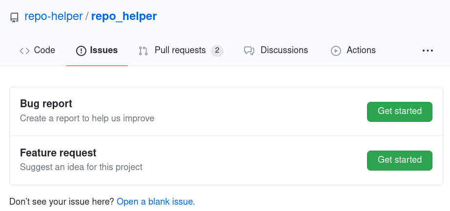
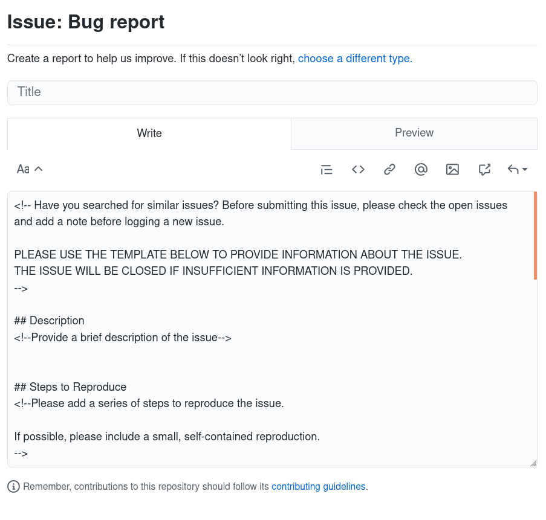

==================
Getting Started
==================

Each project's source code and issue tracker are hosted on GitHub.
Before making your first contributing you will need a GitHub_ account.
If you don't already have an account visit https://github.com/join .

Issues
-------

Issues can be reported using the issue trackers on GitHub.
Click the :guilabel:`Issues` tab at the top of the repository's page and then click the green :guilabel:`New` button.
You'll be presented with a list of issue templates to choose from:

Once you've chosen the template that best fits your issue you'll see a template like this:

Feel free to remove any sections which you don't think are relevant.

Making Changes
-------------------------

Before making changes to the code you will need to fork the repository and clone your fork.
GitHub have an excellent guide to this at https://guides.github.com/activities/forking/.

Once you have done this you'll need to set up your development environment.
The recommended tool is `pyproject-devenv`_, which will automatically install the project's runtime, build and test requirements:

.. prompt:: bash

	cd <project_dir>
	python3 -m pip install pyproject-devenv
	pyproject-devenv

This will create the virtualenv in the ``venv`` directory.
Alternatively you can use virtualenv_ and install the dependencies with pip manually.

In either case, be sure to `activate the virtual environment`_.
With bash:

.. prompt:: bash

	source venv/bin/ACTIVATE

.. code-block:: bash

	(repo-helper) $

.. _GitHub: https://github.com/
.. _pyproject-devenv: https://pyproject-devenv.readthedocs.io
.. _virtualenv:
.. _activate the virtual environment:

.. TODO:: making the changes themselves and then making a PR
