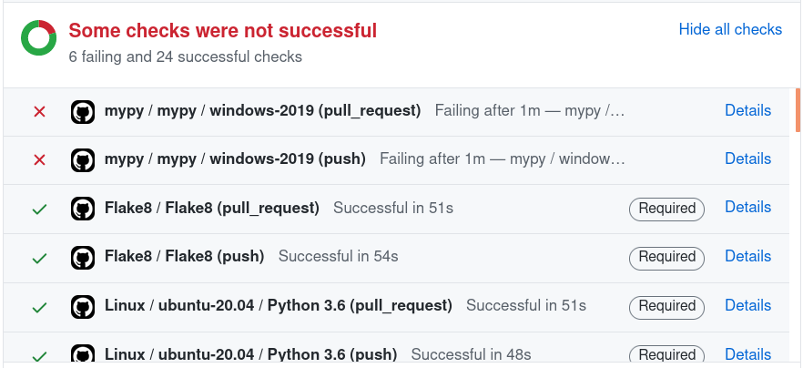
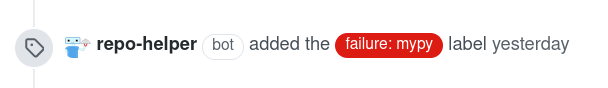

=========
Testing
=========

tox_ is used to automate testing, with the tests themselves run with pytest_.

Start by installing ``tox`` and `tox-envlist`_ if you don't already have them:

.. prompt:: bash

	python3 -m pip install tox tox-envlist

To run tests for a specific Python version, such as Python 3.6:

.. prompt:: bash

	tox -e py36

or, to test all Python versions:

.. prompt:: bash

	tox -n test

.. _pytest: https://docs.pytest.org
.. _tox: https://tox.readthedocs.io
.. _tox-envlist: https://tox-envlist.readthedocs.io

Type Annotations
-------------------

Type annotations are checked using mypy_:

.. prompt:: bash

	tox -e mypy

.. _mypy: https://mypy.readthedocs.io/en/stable/

Code Quality
-------------------

Run flake8_ with ``tox`` to ensure your changes don't introduce any issues:

.. prompt:: bash

	tox -e flake8

.. _flake8: https://flake8.pycqa.org/en/latest/

Coverage
------------

.. TODO:: this section
.. TODO:: coverage measurements in pull requests

On POSIX systems with Firefox_ installed an HTML coverage report can be generated by running:

.. prompt:: bash

	tox -n cov

Ensure your changes do not cause a significant decrease in the test coverage.
If the coverage drops below the level set in ``repo_helper.yml`` (or 80% not specified) the tests will fail.

.. _Firefox: https://www.mozilla.org/en-GB/firefox/

GitHub Actions
-----------------

Tests are run on pushes to GitHub using `GitHub Actions`_.
You can see the results of these test at the bottom of the pull request page:

A label will be added to the pull request automatically if the tests fail:

This makes it easy to identify which tests are failing.
Once the tests pass the label will be removed automatically.

If you are a first time contributor to a project manual approval is required for GitHub Actions to run.
For more information see https://github.blog/2021-04-22-github-actions-update-helping-maintainers-combat-bad-actors/

`Branch protection`_ is used to ensure the following tests pass before merging pull requests:

* Tests on Windows and Linux for all CPython version between 3.6 and 3.9 supported by the project.
* Tests on Windows and Linux for PyPy 3.6, if supported by the project.
* mypy type checking on Windows and Linux.
* Flake8
* The documentation check, if the project has documentation.

If the project only supports Linux the tests on Windows will not run and are not required to merge the pull request.

Tests on macOS are optional as they take longer than other platforms.
CPython 3.10 and PyPy 3.7 are considered experimental and will not block a pull request from being merged if they fail.
However, you should still check the results of these runs to ensure your changes have not introduced any errors there.

You should check the :guilabel:`Files changed` tab of the pull request to see whether any issues have been identified.
This can be due to syntax errors in the documentation source or issues identified by flake8 and Codefactor_.

Your pull request may be commented on by Coveralls_ to report any changes to the code coverage.

.. _GitHub Actions: https://github.com/features/actions
.. _Branch protection: https://docs.github.com/en/github/administering-a-repository/about-protected-branches
.. _Codefactor: https://www.codefactor.io/
.. _Coveralls: https://coveralls.io/
